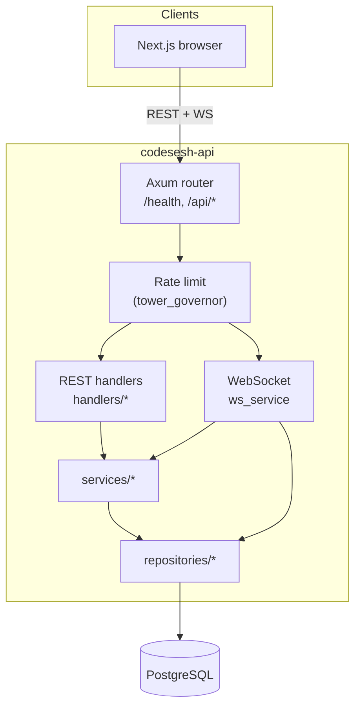

# CodeSesh API

Rust **HTTP + WebSocket** service for **CodeSesh**: sessions, participants, chat, private notes, realtime collaborative editing, pings, and optional **run** telemetry. It is built with **Axum**, **SQLx** (PostgreSQL), and in-memory coordination for active WebSocket sessions.

The **browser client** lives in [`codesesh-frontend`](../codesesh-frontend). **Live site:** [https://codesesh.xyz](https://codesesh.xyz).

---

## What this service does

- **REST** under `/api` — users, sessions (CRUD-style operations, join, list messages, notes).
- **WebSocket** — `GET /api/sessions/{short_id}/ws?user_id=<uuid>` for realtime sync: document updates, cursors, chat, language changes, pings, session end.
- **Persistence** — PostgreSQL via SQLx migrations (`migrations/`).
- **Rate limiting** — `tower_governor` on `/api` routes.
- **Auth model** — Authenticated REST handlers expect header **`X-User-Id: <uuid>`** (no cookies, no JWT in-repo). The WebSocket handshake validates `user_id` in the query string.

Code execution in production is handled by the **Next.js** app calling **OneCompiler**; this API exposes **`POST /api/runs`** to record runs and a **stub** `POST /api/sessions/{short_id}/execute` (reserved for future Judge0-style integration — see `JUDGE0_URL` in config).

---

## Tech stack

| Layer | Crates / tools |
|--------|----------------|
| HTTP / WS | **Axum** 0.8 (`ws`, `macros`) |
| Async runtime | **Tokio** |
| Middleware | **tower**, **tower-http** (CORS, trace, timeout, request-id), **tower_governor** |
| Database | **SQLx** (PostgreSQL, migrations, macros) |
| Serialization | **serde**, **serde_json** |
| Validation | **validator** |
| IDs | **uuid** |
| In-memory session hub | **DashMap** |
| HTTP client | **reqwest** (e.g. external services) |
| Config | **dotenvy**, env vars |

---

## Architecture



- **`state::AppState`** holds the DB pool, config, and shared in-memory structures for live sessions.
- **`ws_service`** bridges sockets to **`broadcast`**, **`event_buffer`**, and repositories for chat / session rows.

---

## HTTP routes (summary)

| Method | Path | Notes |
|--------|------|--------|
| GET | `/health` | Liveness |
| GET | `/api/users/me` | Current user (`X-User-Id`) |
| POST | `/api/users` | Create user |
| GET/POST | `/api/sessions` | List / create session |
| GET | `/api/sessions/{short_id}` | Session detail |
| PATCH | `/api/sessions/{short_id}/name` | Rename |
| PATCH | `/api/sessions/{short_id}/visibility` | Visibility |
| PATCH | `/api/sessions/{short_id}/end` | End session |
| GET | `/api/sessions/{short_id}/participants` | Participants |
| GET | `/api/sessions/{short_id}/participation` | Current user’s participation |
| POST | `/api/sessions/{short_id}/join` | Join session |
| GET | `/api/sessions/{short_id}/messages` | Chat history |
| GET/PATCH | `/api/sessions/{short_id}/notes` | Private notes |
| GET | `/api/sessions/{short_id}/ws` | WebSocket upgrade |
| POST | `/api/sessions/{short_id}/execute` | Stub response (future execution bridge) |
| POST | `/api/runs` | Record a code run (telemetry) |

All `/api` routes except WebSocket are behind the configured rate-limit layer.

---

## Getting started

### Requirements

- **Rust** (see `rust-version` in `Cargo.toml`)
- **PostgreSQL** reachable with a connection string

### Configuration

Copy `.env.example` to `.env` and set **required** variables:

| Variable | Purpose |
|----------|---------|
| `DATABASE_URL` | PostgreSQL URL for SQLx |
| `FRONTEND_URL` | Allowed browser origin for **CORS** (e.g. `http://localhost:3000` or `https://codesesh.xyz`) |
| `JUDGE0_URL` | Required by config today (future execution integration); use a placeholder URL locally if unused |

Optional: `HOST` (default `0.0.0.0`), `PORT` (default `8080`), `RATE_LIMIT_PER_SECOND`, `RATE_LIMIT_BURST_SIZE`.

### Run the server

```bash
# From codesesh-api/
cargo run
```

On startup the binary loads `.env`, **applies SQLx migrations** from `./migrations`, binds `HOST:PORT`, and serves the app. Ensure PostgreSQL is running and `DATABASE_URL` is correct before the first run.

### Develop against the frontend

1. Start PostgreSQL and this API (e.g. `http://localhost:8080`).
2. In **codesesh-frontend**, set `NEXT_PUBLIC_API_URL=http://localhost:8080` and run `pnpm dev`.
3. Ensure `FRONTEND_URL` matches where the browser loads the Next app so CORS passes.

---

## How clients authenticate

- **REST:** Send **`X-User-Id`** with a UUID that exists in the `users` table (created via `POST /api/users`).
- **WebSocket:** Pass **`user_id`** as a query parameter; must be an existing participant for active sessions.

There is **no** `Set-Cookie` session in this API — session tracking is explicit UUID identity.

---

## Related repo

- **[codesesh-frontend](../codesesh-frontend)** — Next.js UI, OneCompiler proxy for **Run**, WebSocket client.
